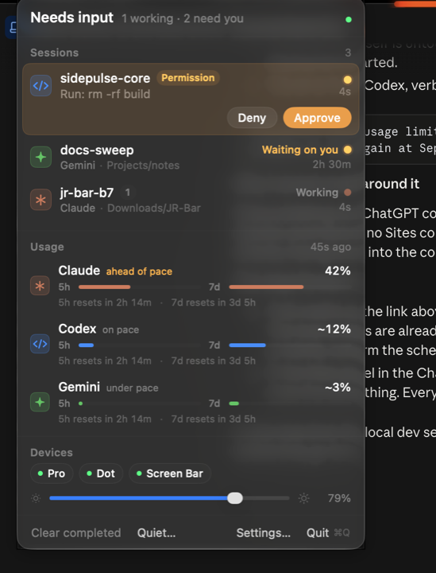
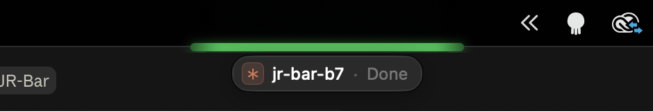
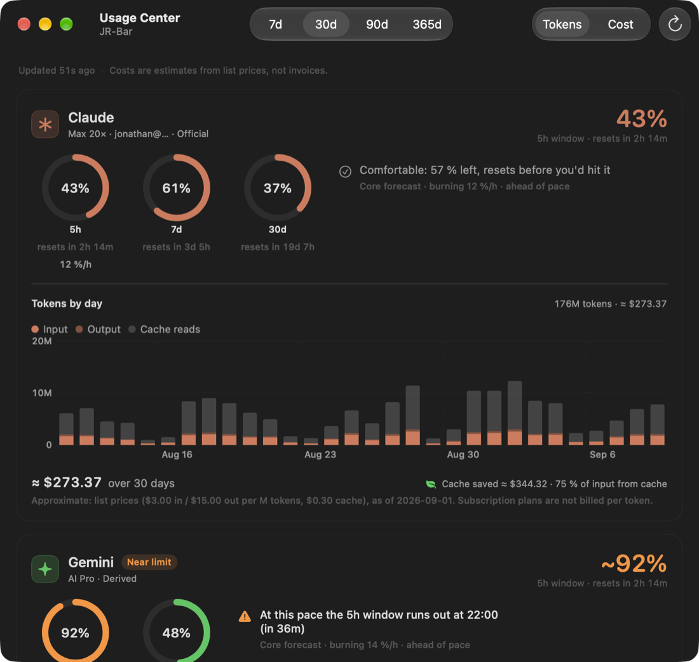
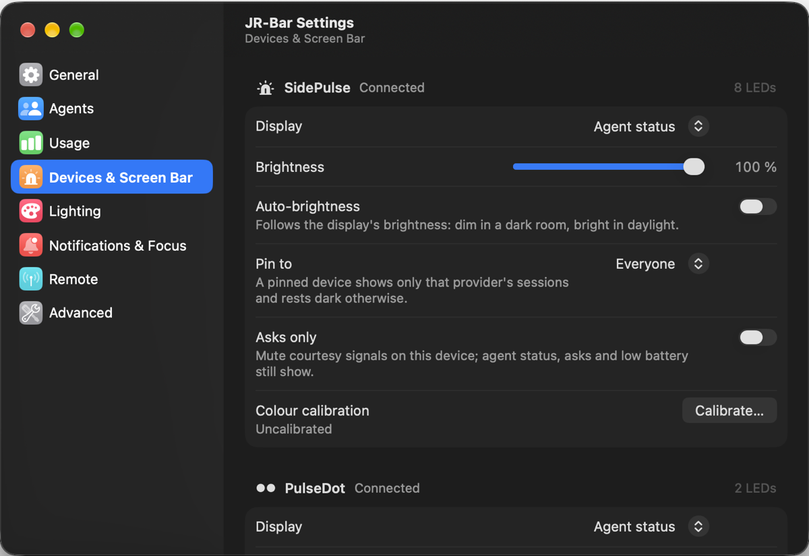
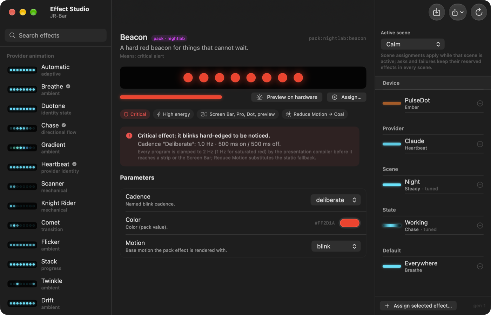
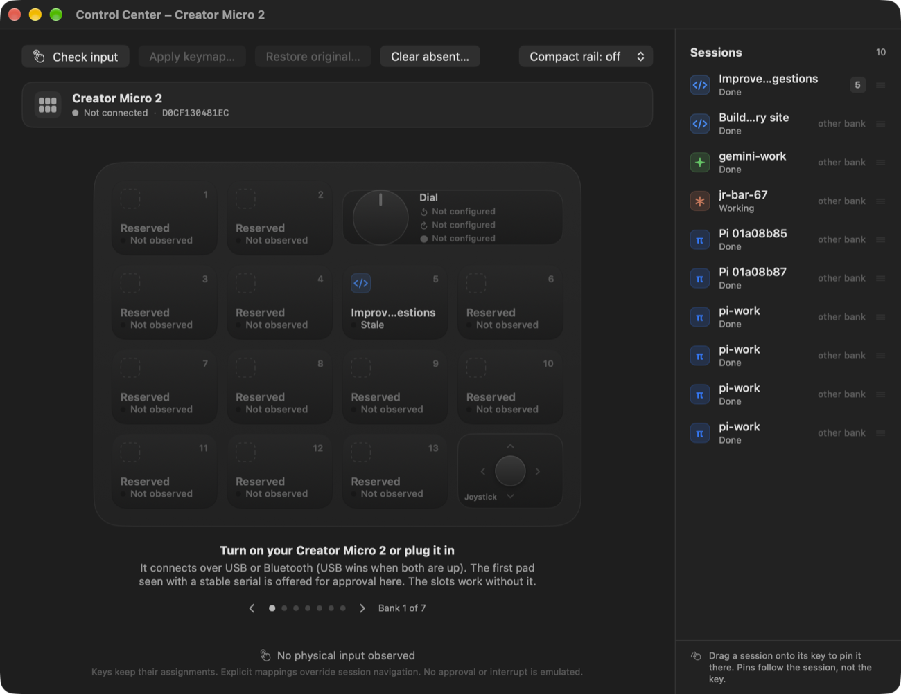

# JR-Bar

Your coding agents, as light. JR-Bar is a native macOS menu-bar app that
watches Claude Code, Codex, Gemini CLI and friends and turns what they are
doing into a glow: breathing in the session's colour while an agent works,
a green sweep when it finishes, amber that escalates when one is stuck
waiting on you. The light lives on a SidePulse strip in the SD slot, on a
Dot in a USB-C port, and on the Screen Bar, one unsegmented band tucked under
the MacBook notch. No hardware is required.

<p align="center">
  
</p>

It is built to feel like the tools it sits beside: a glass panel off the
status item, keyboard first, a Settings window that looks like System
Settings, no web views. The app is Swift and SwiftUI; a Python daemon
bundled inside it owns the facts.

## What it does

- **Knows which sessions are real.** Every provider hook runs a 3 ms
  compiled shim. The daemon pairs each event with the agent's process,
  sweeps the process table every 5 s, reads Claude's per-process session
  files and tails Codex, pi and Gemini transcripts, so a session that died
  is marked ended within seconds instead of glowing all afternoon. Main
  sessions and their sub-agent workers are told apart; a finished task you
  have not looked at yet is different from one you have.
- **Escalates only for real asks.** A permission prompt, an input request
  or an error turns the light amber, then pulses the menu-bar icon, then
  chimes every 30 s until you answer. A turn that merely ended with a
  question does not. Asks are pinned at the top of the panel with Approve
  and Deny (⌘↩ / ⌘D) and arrive as banners with the same two actions.
- **The Screen Bar.** A 6 pt band under the notch playing the same LEDS
  program as the strip, phase-locked to it, blended from eight samples into
  one gradient (never a row of segments). Hover shows the top session and a
  plain-language line about the light; click jumps to that session's
  terminal. It follows Alcove's capsule width and stays up over full-screen
  apps.

<p align="center">
  
</p>

- **Pro and Dot as one.** When both are mounted they are written in one
  command from one presentation, and the Dot replays the strip's program at
  a fraction of its brightness, so the two read as a single instrument.
  Per device: display mode (agent status, battery, studio, quota runway),
  brightness with auto-brightness, provider pin, asks-only, and colour
  calibration with per-channel gains and resting glow previewed live.
- **Usage with a forecast.** The panel shows each provider's 5 h and 7 d
  windows with reset countdowns and a pace verdict; the Usage Center adds
  rings per window, a least-squares forecast of when the window runs out
  ("At this pace the 5h window runs out at 22:00"), and daily or hourly
  token and cost graphs from your local transcripts with the cache savings
  spelled out. Claude's official usage endpoint is opt-in.
- **Effect Studio.** A library of motions (Breathe, Heartbeat, Chase,
  Gradient, Knight Rider, Comet, Twinkle, …) and data-only JSON packs,
  assignable by device, project, provider, scene or state, with parameters
  as native controls, a live strip preview, a 5 s preview on the real
  hardware, and import/export. Scene packs — a data-only bundle that
  re-themes every scene's effect policy at once — install, update and
  preview through the same machinery, migrated forward from older schema
  versions on the way in. Every program is clamped by the presentation
  compiler (2 Hz, 1 Hz for saturated red) before it reaches a strip or the
  screen.
- **Lighting that knows the room.** Auto-dim by schedule, by display
  brightness, or by the ambient light sensor; idle and sleep dimming; quiet
  hours; macOS Focus following with a dim rule per Focus; Mute, Dim, Pause,
  Asks-only and Dark modes for a while from the panel's Quiet… menu.
- **Keeps the Mac awake for agents, and only for them.** While agents work
  the daemon holds a sleep assertion and lets go when they finish. With the
  closed-lid policy on `agents`, a small `pmset` helper (one sudoers rule)
  keeps a clamshell Mac running through a long task and lets it sleep when
  the task ends or the quota is gone.
- **Away from the desk.** Calendar and Reminders glows; a webhook that POSTs
  JSON moments (blocked for minutes, finished, quota crossed) to ntfy, Home
  Assistant or anything with a URL; a read-only view of another Mac's
  sessions over Tailscale and SFTP; HMAC-signed usage sync between Macs; a
  loopback ingest listener so cloud-hosted agents can report in.
- **Creator Micro 2 Control Center.** Thirteen session keys with pins and
  banks, the dial and joystick, a compact rail on any screen edge, keymap
  apply and restore with a private backup of the pad's original. It works
  without the pad; the pad has so far been verified only powered off.
- **History, doctor, updates.** An activity window grouped by day with a
  "while you were away" banner that measures from when you last looked;
  a stuck or finished row can be dismissed until its session next speaks;
  a Doctor checklist and `jrbar hooks doctor`; Sparkle updates from this
  repository's releases, manual until you turn automatic checks on, with a
  beta channel.

<p align="center">
  
</p>

## Hardware (optional)

| | |
| :---: | :---: |
|  |  |
| **SidePulse Pro**: eight LEDs on an SD card, for MacBook Pro. | **SidePulse Dot**: two LEDs on USB-C. |

Both mount as tiny volumes; JR-Bar writes a small program to `LEDS.LED`
atomically (the DSL is [`LEDS_FORMAT.md`](LEDS_FORMAT.md)), so an eject
mid-write cannot leave the firmware a torn program. A first-batch Dot
mounts as `PulseDot` and is recognised as such. The
[Creator Micro 2](docs/CONTROL-CENTER.md) speaks a vendor HID protocol
over USB or Bluetooth and is driven by the same daemon. Without any of
them, the Screen Bar is the light.

## Providers

| | Providers |
| --- | --- |
| Supported (hooks, session truth, usage where the provider exposes it) | Claude Code, Codex (CLI and desktop), Gemini CLI, Pi, Grok, Devin, OpenCode, OpenClaw, Antigravity |
| Best effort (hook shapes known, not exercised on the author's Mac) | Cursor, Hermes Agent, Kiro |
| Neighbours, not providers | T3 Code (read-only session projection, [docs/INTEGRATIONS.md](docs/INTEGRATIONS.md)); Alcove (the Screen Bar matches its capsule) |

Hooks are registered by the app on its first launch for every provider
with a config on the Mac, and can be installed, reinstalled or removed
per provider in Settings › Agents. Codex's trust hash is recomputed
locally for the exact command written. How each provider is read, and
what its usage lanes mean, is in [docs/NATIVE-PROVIDERS.md](docs/NATIVE-PROVIDERS.md);
adding one is [docs/PROVIDER-ADAPTER-GUIDE.md](docs/PROVIDER-ADAPTER-GUIDE.md).

## Install

Requirements: an Apple silicon Mac on macOS 26 or newer. JR-Bar is one
signed app bundle carrying the daemon and the hook shim; nothing else is
installed on the system.

From a [GitHub release](https://github.com/JonathanRReed/JR-Bar/releases),
once one is published: download `JR-Bar-<version>.pkg` and run it. Until
then, build it yourself (Command Line Tools with Swift 6.2+, Python 3.12):

```sh
git clone https://github.com/JonathanRReed/JR-Bar.git && cd JR-Bar
make package          # dist/JR-Bar-0.8.0.pkg, signed with whatever identity the keychain has
make clean-install    # installs it into ~/Applications (no password) and opens it
```

`sudo installer -pkg dist/JR-Bar-0.8.0.pkg -target /` puts it in
`/Applications` instead. On first launch the app starts its daemon, points
every provider's hook at the bundled shim, and registers itself as a login
item. Click the icon for the panel; right-click for the menu. The command
line lives inside the bundle:

```sh
alias jrbar='~/Applications/JR-Bar.app/Contents/Helpers/jrbar-core.app/Contents/MacOS/jrbar-core'
jrbar hooks doctor    # what each provider's config runs today, and the sockets
jrbar doctor          # daemon commit, memory, checks
```

To remove it: quit the app, delete `JR-Bar.app`, and run
`jrbar agent-monitor uninstall all` first if you want the hooks gone.
`scripts/uninstall-macos.sh` does the same for a `/Applications` install.

### Permissions

Everything works with nothing granted; features ask when you turn them on.

| Permission | Unlocks | Asked when |
| --- | --- | --- |
| Notifications | Ask and completion banners, with Approve / Deny on asks | The first time a banner is due, never at launch |
| Accessibility | Answering an ask by keystroke into the session's terminal (a Creator Micro 2 key, or Approve / Deny when the terminal is frontmost) | The first time you answer that way |
| Calendar, Reminders | Event and reminder glows | When you enable those signals |
| Screen Recording | The Screen Bar following Alcove's live capsule width | Automatic if granted; skipped quietly otherwise |
| Full Disk Access | macOS Focus following (reads the Focus database) | When you turn Focus following on |
| An administrator password, once | The closed-lid sleep helper (`/etc/sudoers.d/jrbar-disablesleep`) | When you set the closed-lid policy |

Grants are keyed to the signed `JR-Bar.app`; a development build signed
differently is a different app to macOS and asks again.

## Screenshots

<p align="center">
  
</p>
<p align="center">
  
</p>
<p align="center">
  
</p>

## How it is built

`JR-Bar.app` (Swift, `app/`) owns every pixel; `jrbar-core` (Python,
`src/jrbar`, frozen into `Contents/Helpers/jrbar-core.app`) owns every fact
and runs headless as the app's supervised child; `jrbar-hook`
(C, `hook/`) is the command every provider config runs. App and daemon
talk newline-delimited JSON over `~/.local/state/jrbar/core.sock`: the
daemon pushes `state`, `lights`, `settings` and `event` documents, the app
sends commands (`open_session`, `answer_ask`, `set_setting`,
`preview_program`, `deck_press`, …) and replaces its model wholesale on
every frame. The contract is [docs/CORE-PROTOCOL.md](docs/CORE-PROTOCOL.md);
the process map, data paths and module map are
[docs/ARCHITECTURE.md](docs/ARCHITECTURE.md); the bundle and signing are
[packaging/README.md](packaging/README.md).

## Development

```sh
./scripts/bootstrap-dev.sh              # Python 3.12 venv at .venv, pinned tools
make fast                               # lint, imports, contract and focused tests
.venv/bin/python -m pytest tests        # the full Python suite (about five minutes)
cd app && swift build && swift test     # the Swift package and its suites
make package                            # the signed bundle, PKG and Sparkle archive
```

`app/README.md` covers running the Swift app against a checkout's daemon
(`JRBAR_CORE_EXEC=scripts/run-core.sh`) or the mock daemon
(`app/scripts/mock-core.py`, on its own socket; never on the real one).
Releasing is [docs/PRODUCTION-RELEASE.md](docs/PRODUCTION-RELEASE.md); the
feature status is [docs/FEATURE-MATRIX.md](docs/FEATURE-MATRIX.md); what is
next is [docs/ROADMAP.md](docs/ROADMAP.md). CI runs the same three checks on
a hosted macOS 26 runner. See [CONTRIBUTING.md](CONTRIBUTING.md).

## Migrating from SidePulse

0.8 is the first release under the JR-Bar name; earlier ones shipped as
SidePulse (`sidepulse`, `SidePulse.app`, `io.sidepulse.*`). Nothing has
to be done by hand:

- On first launch the daemon copies `~/.config/sidepulse`,
  `~/.local/state/sidepulse`, `~/.local/share/sidepulse` and
  `~/Library/Application Support/SidePulse` into their JR-Bar counterparts
  (copied, never moved; nothing already under a JR-Bar path is overwritten;
  `~/.local/state/jrbar/migrated-from-sidepulse.json` records it so it
  happens once).
- Every hook shape SidePulse ever registered (`python -m
  sidepulse.hook_client`, `agent_monitor.hook_entry`, the `sidepulse-status`
  OpenClaw and Antigravity hooks, the `sidepulse.js` OpenCode plugin, the
  Kiro and Grok files) is replaced in place by the bundled shim, and Codex's
  trust hash is refreshed. The old `io.sidepulse.agentstatus` and
  `com.sidepulse.agentstatus` LaunchAgents are unloaded and removed; the
  app is a login item now, not a LaunchAgent.
- Keychain secrets are copied forward on first read
  (`io.sidepulse.provider.<id>` → `com.jonathanreed.jrbar.provider.<id>`).
- `SIDEPULSE_*` environment variables, the `sidepulse` command and
  `sidepulse.*` imports keep working for this one release and go away in
  the next.

macOS keys permissions to the bundle identifier, so the grants above are
asked for again. Once the app is running and `jrbar hooks doctor` says
every provider runs the shim, the old `~/.config/sidepulse`,
`~/.local/state/sidepulse` and `~/.local/share/sidepulse` directories can
be deleted.

## Credits

JR-Bar began as a fork of [inteliwear/sidepulse](https://github.com/inteliwear/sidepulse),
the companion app for the [SidePulse](https://sidepulse.io) hardware, and
is fully divergent: hardware stays first-class, the UI is new, upstream
work is ported behaviour by behaviour rather than merged. Many monitoring
semantics and usage-tracking techniques were adopted, with citations in the
code, from studying [T3 Code](https://github.com/pingdotgg/t3code) and
[CodexBar](https://github.com/steipete/CodexBar). The LEDS format and the
hardware are upstream's. Licensed under the MIT license, like upstream.
